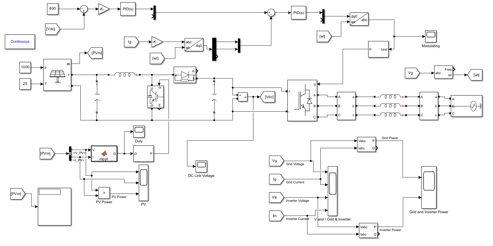

# ☀️ 5 MW Grid-Connected PV System (3-Phase Inverter)

This project models and simulates a **5 MW grid-connected photovoltaic (PV) system** using a **3-phase voltage-source inverter (VSI)** in **MATLAB/Simulink**.  
It demonstrates PV power generation, MPPT control, inverter operation, and grid synchronization under variable irradiance and temperature conditions.

---

## ⚙️ System Overview

The system consists of the following main subsystems:
1. **PV Array** – Generates DC power based on solar irradiance and temperature.
2. **MPPT Control** – Uses a perturb-and-observe algorithm to extract maximum power from the PV array.
3. **DC-Link Converter** – Stabilizes DC voltage before feeding the inverter.
4. **3-Phase Inverter** – Converts DC to AC using sinusoidal PWM (SPWM).
5. **LCL Filter** – Reduces switching harmonics and ensures smooth current waveform.
6. **Grid Connection** – Synchronizes inverter output with the grid to export real power.

---

## 🧩 Simulink Model

**Figure 1.** *Simulink model of the 5 MW grid-connected photovoltaic system with MPPT, DC-link control, and 3-phase inverter.*

The model operates in the **continuous simulation mode** and includes key measurements such as:
- PV voltage, current, and power  
- Inverter current and voltage  
- Grid current and voltage  
- DC-link voltage  
- Real and reactive power flow  

---

## 📊 Simulation Parameters

| Parameter | Symbol | Value |
|------------|---------|-------|
| PV Rated Power | PPV | 5 MW |
| DC Link Voltage | Vdc | 800 V |
| Grid Voltage (L-L RMS) | Vac | 400 V |
| Switching Frequency | fsw | 10 kHz |
| Fundamental Frequency | fgrid | 60 Hz |
| Filter Type |  | LCL |

---

## 🧠 Control Strategy

- **MPPT Algorithm:** Perturb and Observe (P&O)  
- **DC-Link Voltage Regulation:** PID controller  
- **Inverter Control:** Sinusoidal PWM  
- **Grid Synchronization:** Phase-locked loop (PLL)

---

## 📈 Key Results

The simulation verifies:
- Stable DC-link voltage regulation at 800 V  
- Effective MPPT tracking for changing irradiance  
- Smooth 3-phase grid current with low THD  
- Real power transfer from PV array to the grid  

---

## 🚀 How to Run

1. Open `PV_5MW_GridConnected.slx` in MATLAB/Simulink (R2023b or later).  
2. Set the simulation mode to **Continuous**.  
3. Run the model and observe signals in the **Scope** blocks or **Simulink Data Inspector**.  
4. Adjust irradiance and temperature to test dynamic performance.

---

